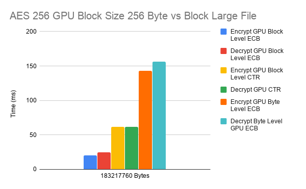

CUDA AES encryption
======================

**University of Pennsylvania, CIS 565: GPU Programming and Architecture, Project 2**

* Eric Micallef
  * https://www.linkedin.com/in/eric-micallef-99291714b/
  
* Tested on: Windows 10, i5, Nvidia GTX 1660 (Personal)

- [Repo Contents](#Repo-Contents)
- [AES Overview](#AES-Overview)
	- [Cipher](#Cipher)
		- [Mix Columns](#Mix-Columns)
  		- [Shift Rows](#Shift-Rows)
  		- [Sub Bytes](#Sub-Bytes)
  		- [Add Round Key](#Add-Round-Key)
  	- [ECB Mode](#Electronic-Code-Book-Mode)
  	- [CTR Mode](#Counter-Mode)
- [Algorithm Overview](#Algorithm-Overview)
  - [Block Level](#Block-Level)
  - [Byte Level](#Byte-Level)
- [Performance Analysis](#Performance-Analysis)
  - [Compiler Exploits](#Compiler-Exploits)
  - [Varying BlockSizes](#Varying-BlockSizes)
- [Resources](#Resources)

# Repo Contents
Please note, since this repo uses submodules will need to use git clone --recurse. 

This repo contains code that benchmarks the well known cryptography Advanced Encryption Schema algorithms.

We run ECB and CTR modes on both the CPU and GPU to see the benefits that can be obtained with highly parallel algorithms on highly parallel hardware.

The CPU benchmark is written in C, The GPU benchmark is written in CUDA.

The GPU benchmark has two different methods for encrypting and decrypting. One can encrypt and decypt at the granularity of a byte or a block. Performance and details are discussed below.

All data gathered can be found in the excel sheet in the root home directory.

# Advanced Encryption Schema (AES) Overview

AES is a highly popular cryptography algorithm. 

AES is a symmetric key algorithm meaning you use the same key to encrypt and decrypt ypur input. 

There exist modes ECB, CBC, OFB, CFB, CTR each offering 128 bit, 192bit and 256 bit level encryption. Each mode goes about encrypting 
the data set in a different manner. This repo focuses on ECB and CTR mode encryption.

## Cipher

The term cipher in AES refers to how the encryption is handled. In the case of AES this involves transforming our bytes through a series of rounds. each round is illustrated and shown below.

### Mix Columns

each column is combined using an invertible linear transformation.

### Shift Rows 

bytes are shifted by row according to which row they are in.

### Sub Bytes

Each byte is substituted with the value in the pre computed look up table

### Add Round Key

Each byte of the current state transformation is XOR'd with the roundkey

## Electronic Code Book Mode

ECB mode is one mode implemented for benchmarking in this repo. It is highly parallelizable. From the diagram above we can see how the algorithm works. 

We inject our plaintext and key into the cipher and our output data is now encrypted with the provided key. 

The major flaw with ECB mode is that this mode replicates patterns. So you could have an encrypted image that looks something like below where the middle image is encrypted using ECB mode and the right is using any other mode. 

As shown we can still get a sense of what the file looks like even after encryption has completed. Other modes address this issue by addinga bit of pseudo randomness into the cipher.

## Counter Mode

From the diagram we see that CTR mode has the same ciphering scheme but, instead of our plain text being injected we cipher an initialization vector. 

an initialization vector (or IV) contains a 32 bit nonce, 32 bit counter and 64 bit unique value. The nonce and unique value in implementation do have to fulfill certain requirements. In short, the nonce must be unique and not used with any other key, but does not necessarily have to be hidden from attackers. More information can be found here: https://tools.ietf.org/html/rfc3686#section-2.1.

after ciphering this IV we XOR it with our output to generate our encrypted file. The counter in the lower 32 bits of the IV add the pseudo randomness which fixes the issue that ECB has.

The nice thing about CTR mode is that your decrpytion and encryption are the same. So in terms of code size this algorithm is the lightest.

# Algorithm Overview

AES128, AES192 and AES256 all follow the same schema where we continually transform our input data over a set of rounds and a fixed size key.

For AES 128 we have a fixed size key of 16 bytes, an expanded key of 176bytes and 10 rounds of transformations that each 16 bytes of data must go through.

For AES 192 we have a fixed size key of 24 bytes, an expanded key of 204 bytes and 12 rounds of transformations that the 16 bytes of data must go through

For AES 256 we have a fixed size key of 32 bytes, an expanded key of 240 bytes and 14 rounds of transformations that the 16 bytes of data must go through.

Each round consists of 4 transformations. Column inverse, row shift, sub bytes and adding the round key. These were shown above.

Since AES can be parrallelized in a few different ways I chose to investigate the question how much parrallelism is too much? 

From analyzing the algorithm you can split it at a block level granularity where each thread operates on one 16 byte block. 

We can also split it up where each thread works on a single byte in the 16 byte block. 

So for block level parallelism if we have a text file of length 128 bytes we will need 8 threads to finsih the work. 

For byte level parallelism with the same text file length of 128 bytes we will need 128 threads to finish the work.

operating at a byte level seems a bit of overkill but you never really know until you do it.

## Block Level

At a block level each thread reads its respective 16 bytes and begins its transformations.

Each round we must perform 16 reads from our look up table and 16 reads from our roundkey per thread. To help reduce latency we move these into shared memory. 

Now, upon launch one thread can read in all of our keys and look up table and every thread in the block can read from shared memory as opposed to main memory. 

Barring any bank conflicts a shared memory read costs around two cycles. This removes the stereotypical memory bottleneck.

## Byte Level

At a byte level we utilize shared memory the same data structures of block level but we must also share the 16 bytes we are working on.

When operating at a byte granularity we need to move the data we want to transform, our key, and our look up table. So the shared memory cost is a bit higher. 

Specifically, for a GPU blocksize of 256 we need to bring an extra 256 bytes to shared memory. 256 bytes is not a significant amount of shared memory space. 

With byte level granularity we get the same benefit of exploiting the use of shared memory for transforming our text.

# Performance Analysis

As we compare across GPU and CPU we begin to see the benefit of parallel processing. Even at 4kbytes the CPU is orders of magnitude slower. 

On a 183Mb file our GPU is a whopping 250 times faster block style and 33 times faster byte style. 

TODO cahnge the title to show alrge and big files

Looking at our performance of byte vs block we see that in smaller data sets (4k - 30k) The byte and block style have similar run times. But as soon as we get into higher than 30k this difference is apparent and we see that block style is more effective. 

With larger files we are launching orders of magnitude more threads. 

for example, a 32kb file will want 32k threads in byte granularity but with block grannularity we launch 2k threads. Since all of our data lives in shared memory scheduling threads very frequently slows down the process. If say, we were doing main memory reads than adding more threads could help because as threads are waiting for memory other threads can be doing work. But since our data lives close we do not have this bottleneck.

As expected, at some point the benefit to launching a new thread diminshes.

So, it looks like the saying of too many cooks in the kitchen is indeed true in this case.

## Varying BlockSizes

Results were gathered with a blocksize of 32,64,128 and 256 on the GPU. As well as encryption modes of 128bits, 192bits and 256 bits. The results were rather uninteresting as it did not play a huge role in timing.

The graph below shows the difference when doing a 128 bit 192 bit or 256 bit encryption. For 256 bit encryption we do more rounds of transformations. The difference in encryption is more noticeable in byte level but not hardly noticeable in block level.  

The graph below shows the difference in changing the blocksize. In the byte level granularity we see that changing the block size does have an impact on the system. But for block level granularity changing this parameter has very minimal effect.

## Compiler Exploits

I spent some time using the unroll pragma on some of the my loops. As well as trying to utilize the memory bus a bit more effectively  by making my own memcopy and typecasting to 64 bits to send bigger chunks of data. This inspiration came from talking to my classmate Taylor Nelms after he had mentioned he did something similar.

I did see some speed up by doing this but then realized an optimized compiler will just do this stuff for me... so... really it was not the most efficient use of my time. 

# Resources

If you too want to become a leet hacker refer to resources below

## Understanding AES encryption/decryption

* https://tools.ietf.org/html/rfc3686#section-2.1
* https://www.comparitech.com/blog/information-security/what-is-aes-encryption/
* https://en.wikipedia.org/wiki/Block_cipher_mode_of_operation#Counter_(CTR)
* https://developer.nvidia.com/gpugems/GPUGems3/gpugems3_ch36.html
* https://engineering.purdue.edu/kak/compsec/NewLectures/Lecture8.pdf

## Text Generation

* http://loremfuckingipsum.com/text.php

## Libraries

* https://github.com/kokke/tiny-AES-c
* https://github.com/jarro2783/cxxopts

## Pictures 

* ECB / CTR / AES algorith pictures taken from wikipedia

